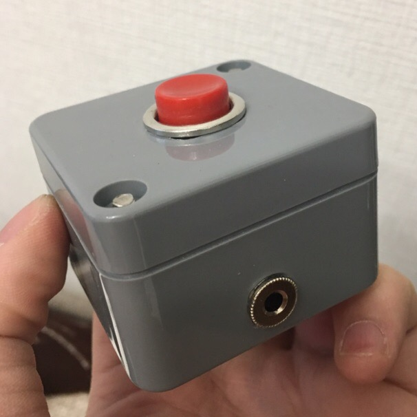
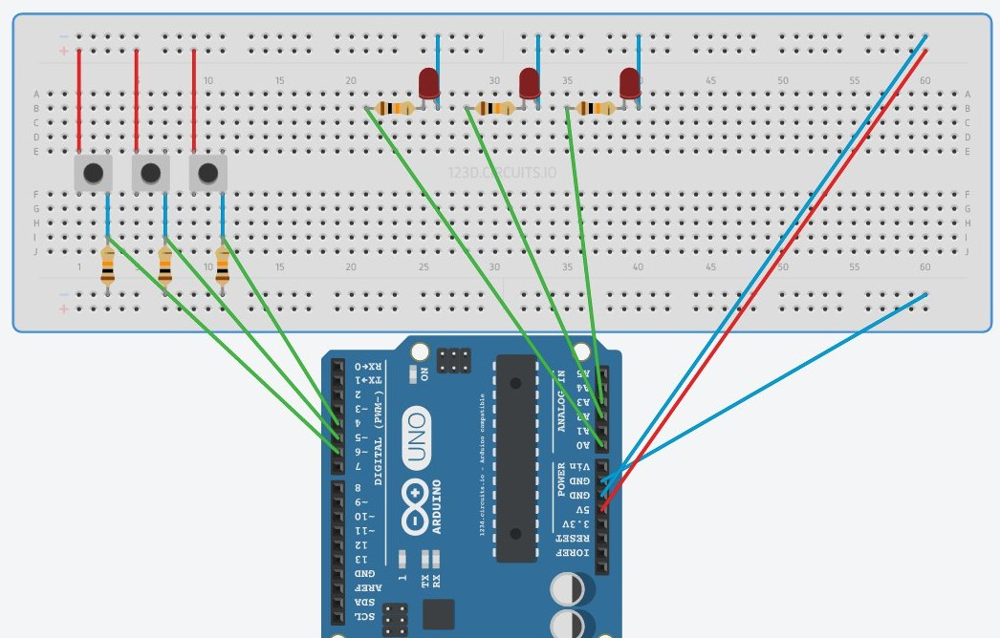

# Как я делал свою собственную брейн-ринг систему

### Disclamer:
В этом репозитории будет больше слов и картинок, чем кода.

## Предыстория
Мы с друзьями любим играть в интеллектуальные игры (ЧГК, Свояк, Брэйн-Ринг) и порой посещаем очные турниры, где часто используют брейн-системы. К сожалению, порой мы даже боялись садиться за игровое место, не говоря уже о нажатии на игровую кнопку. Поэтому я решил сделать свою систему с кнопками и лампочками, чтобы играть в своем кругу и тренироваться.

## 1. Выбор плафтормы
Сперва в проекте задумывалось всего 3 кнопки (как в стандартной "Своей Игре" по телевизору), но позже было расширено до пяти. Исходя из этого, мне была необходима плата с шестью (5 игроков и кнопка старта) цифровым входами и 6 аналоговыми. Связываться с [ЛУТ](https://cxem.net/master/45.php) мне совершенно не хотелось, поэтому я решил остановиться на чем-то более простом и понятном. Например, на Arduino. По количеству портов и компактности мне приглянулась Arduino Nano. Вот распиновка платы: 

## 2. Перифирия
### Порты подключения
В качестве портов подключения (между кнопкой и корпусом системы) я сразу же рассматривал audio jack 3.5mm, так как предполагалось, что кнопки будут часто двигаться (ведь игроки деражт их в руках), а у jack есть фиксация контакта. Более того, на случай резкого выдергивания кнопки из корпуса системы больше подходил jack чем RJ-22 или RJ-45. Да и использовать RJ-45 для двухконтактного соединения мне показалось слишком жирным. Плюсом являлось и то, что на случай выхода из строя провода, его можно было бы купить в любом магазине бытовой техники. Также положительной стороной оказалось легкое крепление в корпус. Необходимо лишь сделать отверстие определенного диаметра и закрепить кольцом с обратной стороны
### Лампочки и кнопки...
..были выбраны самые простые. Так как к середине проекта я решил уложиться хотя бы в 3000₽, то выбирать антивандальные кнопки за 290₽-340₽ было нецелесообразно. По итогу кнопка стала выглядеть как-то так: 
### Корпуса
Корпуса оказались самыми дорогими элементами в этом проекте. Корпус для системы вышел в 450₽, а для кнопки в 250₽. (при учете, что кнопок стало 5).
### Провода
Провода выбрал экранированные, двухжильные. Достаточно толстые.
### Схема подключения
(тут будет схема, а пока вот)

## 3. Логика работы системы
Логика работы системы достаточно проста:
1. Система ожидает старта таймера.
2. Если таймер запущен, то происходит опрос кнопок.
3. Если кнопка нажата, то таймер останавливается, и зажигается лампочка.

## 4. Реализация
Конечно же, реализовывать систему я начал постепенно. Сперва спаял одну кнопку и проверил код, потом втору, потом третью. Но представим, что уже все подключено.    

~~~~
int timeLimit = 30000;
~~~~